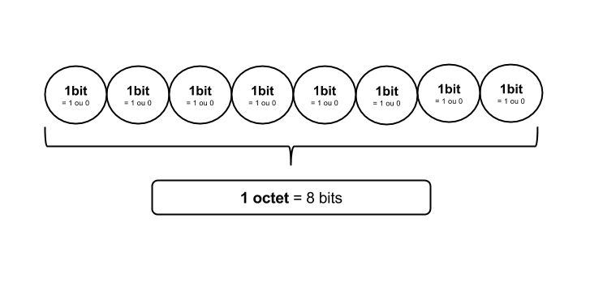

## Introduction

Les nombres binaires sont très utilisés dans le monde informatique. En effet, un ordinateur ne comprend que les 0 et les 1. Cette notion m'a toujours été floue et c'est pourquoi je voulais clarifier tout le schmilblick de ma tête.

## Nombre selon la base

Il existe plusieurs systèmes pour les nombres (ah les cours de math de terminal...) et les plus couramment utilisés sont les suivants:
- système binaire (base 2) : on a la possibilité d'avoir que 2 chiffres, le 0 et le 1.
- système décimal (base 10) : celui que l'on utilise dans la vie de tous les jours pour compter qui comprend les nombres suivants 0, 1, 2, 3, 4, 5, 6, 7, 8, 9.
- système hexadécimal : en plus des nombres du système en base 10, on ajoute les lettres A, B, C, D, E et F

Le système hexadécimal est notamment utilisé pour les adresses MAC (qui sont des identifiants unique de chaque appareil fabriqué dans le monde). Je me focaliserai plutôt sur les systèmes en base 2 et en base 10.

### Transformer des nombres en base 10 (système décimal) en nombre en base 2 (système binaire)

On va transformer les chiffres de 0 à 255 du système décimal en système binaire. Voilà quelques valeurs d'exemple:

| base 10 (décimal) | base 2 (binaire) |
|-------------------|------------------|
| 0                 | 0000 0000        |
| 1                 | 0000 0001        |
| 2                 | 0000 0010        |
| ...               | ...              |
| 168               | 0001 0101        |
| ...               | ...              |
| 255               | 1111 1111        |

### Table de correspondance

On va se servir de la table de correspondance suivante:

| 2^6 | 2^5 | 2^4 | 2^3 | 2^2 | 2^1 | 2° |
|-----|-----|-----|-----|-----|-----|----|
| 64  | 32  | 16  | 8   | 4   | 2   | 1  |

Il s'agit juste de la suite des puissances pour le nombre 2.

On retrouve les 8 chiffres de nos nombres binaires du tableau.

| 2^6 | 2^5 | 2^4 | 2^3 | 2^2 | 2^1 | 2° |
|-----|-----|-----|-----|-----|-----|----|
| 64  | 32  | 16  | 8   | 4   | 2   | 1  |
| 0   | 0   | 0   | 0   | 0   | 0   | 0  |

Ici le 0 en base 10 correspond au 0000 0000 en base 2

### Technique

Prenons un exemple: on souhaite transformer 34 en binaire. On part de la gauche, et on va voir si 34 est inférieur à 128. Si c'est le cas, on met 0. Dans l'autre cas on met 1.

| 2^6 | 2^5 | 2^4 | 2^3 | 2^2 | 2^1 | 2° |
|-----|-----|-----|-----|-----|-----|----|
| 64  | 32  | 16  | 8   | 4   | 2   | 1  |
|     |     |     |     |     |     |    |

Puis on continue avec le 2^6. On a toujours 34 < 64, donc on met 0. En revanche, quand on arrive à 2^5, on a 34 > 32. Donc on "consomme" nos 32. Il ne nous reste plus que 2 (= 34 - 32).

| 2^6 | 2^5 | 2^4 | 2^3 | 2^2 | 2^1 | 2° |
|-----|-----|-----|-----|-----|-----|----|
| 64  | 32  | 16  | 8   | 4   | 2   | 1  |
| 0   | 1   |     |     |     |     |    |

Avec les 2 qui nous restent, on va refaire la même technique en partant de la droite : 2 < 2^4, 2 < 2^3, 2 < 2^2, donc dans ces 3 cas on met 0. Et à 2, on met 1, c'est-à-dire on "consomme" 2, on a plus rien à répartir, donc 0 pour 2°. Au final, on a:

| 2^6 | 2^5 | 2^4 | 2^3 | 2^2 | 2^1 | 2° |
|-----|-----|-----|-----|-----|-----|----|
| 64  | 32  | 16  | 8   | 4   | 2   | 1  |
| 0   | 1   | 0   | 0   | 0   |1    | 0  |

On a donc notre binaire : 0010 0010 // correspond à 34 en décimal

## Un peu de vocabulaire

### Un bit (Définition de wikipédia)

Le bit est un chiffre binaire, c'est-à-dire 0 ou 1.
Il est donc aussi une unité de mesure en informatique, celle désignant la quantité élémentaire d'information représentée par un chiffre du système binaire.
On en doit l'invention à John Tukey et la popularisation à Claude Shannon.

### Un octet

Un octet est ensemble de 8 bits. Un moyen de s'en souvenir est de prendre la racine "oct" qui vient de octo = huit en latin et en grec.

### Représentation

## Application pour les encodages

Essayons de nous replonger dans le contexte de l'époque des premiers ordinateurs. Vous êtes chargé de confectionner un sytème qui permet d'enregistrer des lettres et des chiffres dans un ordinateur qui ne comprend que les 0 et les 1.

Tout d'abord vous faîtes la liste des caractères que l'on utilise la plupart du temps. Au fait, vous êtes américain, donc ne pensez pas aux caractères avec accents, ni aux caractères japonais, ou d'autres langues.

Voici une liste non exhaustive:
- a
- b
- c
...
- z
- 0
- 1
...
- 9
- DEL
- SPACE (un espace tout bête)
- <
- %

Ok on va pas tout faire mais les américains se sont dit. Ok on a 128 caractères possibles au maximum que l'on souhaite utiliser. On va donc essayer de trouver le nombre de chiffres composés uniquement de 0 et de 1 qui nous permettent d'avoir 128 combinaisons possibles.

Je prend un exemple:

Admettons que nous prenions 3 nombre binaires, combien de combinaisons peut-on faire avec ces 3 nombres:

- 000
- 001
- 010
- 100
- 011
- 110
- 101
- 111

On compte **8** combinaisons de façon empirique. Les probabilités nous permettent d'avoir cette formule : 2^3 = 8

Donc si l'on souhaite 128 combinaisons, on va chercher n, tel que 2^n=128

2^4=16, non, 2^5=32, non plus, directement 2^7=128 !!! Super. Il faut donc que nous fassions une suite de 7 chiffres pour avoir 128 possibilités de caractères.

Voyons un bout de liste, si vous avez le courage, vous retrouverez les 128 combinaisons possibles:

- 0000 000
- 0000 001
...
- 1111 111

Génial, maintenant c'est facile on va prendre chaque binaire et leur attribuer un caractère. C'est la table ASCII qui nous donne cette correspondance, en voici un extrait:

| Decimal | Binaire   | Char             |
|---------|-----------|------------------|
| 0       | 000 0000  | NULL             |
| 1       | 000 0001  | START OF HEADING |
| ...     | ...       |                  |
| 30      | 0011 110  | 0                |
| 31      | 0011 111  | 1                |
| ...     | ...       | ...              |
| 65      | 1000 001  | A                |
| 66      | 1000 010  | B                |
| ...     | ...       | ...              |
| 97      | 1100 001  | a                |

A ce moment là, vous vous êtes dit ok, mais comment l'ordinateur saura quand se termine un caractère. On va rajouter un bit à la fin qui sera à 0. Quand on cherchera à lire la suite des 0 et des 1, on pourrra couper en octet. (8bits)

### Les pays non-anglophones se rebellent

Les autres pays qui souhaitaient enregistrer des données dans un ordinateur, ont souhaité créer de nouvelles normes appelées des normes ISO. Cela marchait par zone de pays.

Ainsi on a changé la table ASCII selon d'autres alphabets pour des pays qui ont des caractères accentués. Par exemple la table de correspondance selon la norme ISO 8859-1 concerne les pays de langue allemand, anglais, basque, catalan, danois, espagnol, italien, ... Dans cette norme on a en plus utiliser le dernier bit (le 8ème) pour pouvoir faire des combinaisons avec (au lieu de le laisser à 0 comme en ASCII). On a donc 8 bits possibles, soit 2^8=256 caractères possibles.

Des caractères ont été remplacés, c'est pour cela qu'apparaîssent des caractères étranges dans un fichier. Il a été écrit et enregistré avec le système ISO-xxx et on le lit en utf8 (une autre norme dont on va parler plus tard).

On s'est rapidement retrouvé avec beaucoup trop de normes incompatibles les unes avec les autres. De plus comment intégrer les alphabets chinois et japonais qui contiennent plus de 4000 signes ? On a donc repensé le problème dans les années 90 et les normes utf32, utf16 et utf8 ont été crééés.

### Norme utf32

On a repris le même raisonnement que l'on a eu pour créer la table ASCII. Combien de signes souhaitons-nous pouvoir convertir en binaire ? 2^32 = 4 294 967 296 combinaisons ! Cela devait suffire pour tous les signes existants dans toutes les langues du monde !!

Le problème est que cet encodage va prendre enormément de place dans la mémoire car chaque caractère sera sur 32 bits = 4 octets.

### Norme utf8

On va faire correspondre des caractères à des nombres sur 1,2 et 4 octets. Ainsi on va utiliser la table ASCII qui sont sur 1 octet et, on va ajouter des correspondances entre des caractères et des nombres sur 2 ou 4 octets.

## Application pour les adresses IP

### Norme IPv4

Une adresse IP s'écrit sur 4 octets (donc 4 x 8 = 32 bits).

On simplifie l'écriture en écrivant en décimal car l'écriture en binaire serait trop longue.

Par exemple : 192.168.0.1 qui s'écrirait en binaire 00000011.00010101.00000000.11111111

La norme des adresses IPv4 s'appuie sur cette écriture sur 4 octets. Or si l'on compte le nombre d'adresses IP que l'on pourra créer sera de 2^32 = 4 294 967 296 combinaisons ! Ca parait beaucoup mais avec l'augmentation du nombre d'appareils connectés à internet, on ne pourrait connecter que ces 4 294 967 296 IPs dans le monde. Pour pallier ce problème, chaque box fait office de routeur et a sa propre IP. Chez vous, votre box a eu une adresse IP unique quand elle est connectée à internet. Les appareils qui se connectent à votre box vont avoir une IP locale interne au réseau (souvent 192.168.0.x par convention) qui peut changer selon les connexions. Cela va limiter le nombre d'adresses IP à allouer à tous les appareils qui sont directement connectés à internet.

### Norme IPv6

Malgré tout, il se pourrait que cette limite approche rapidement, on a donc créé une norme IPv6 qui comme son nom l'indique, va utiliser des IPs qui sont codés sur 6 octets = 6 x 8 = 48 bits. On va donc avoir 2^48 = 2.8147498e+14 possibilités !! Ca fait beaucoup et devrait nous laisser le temps. Mais qui sait devrons-nous créer une norme IPv8 dans le futur ?
